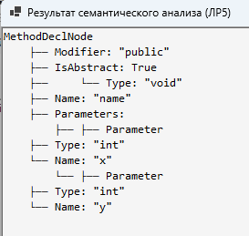
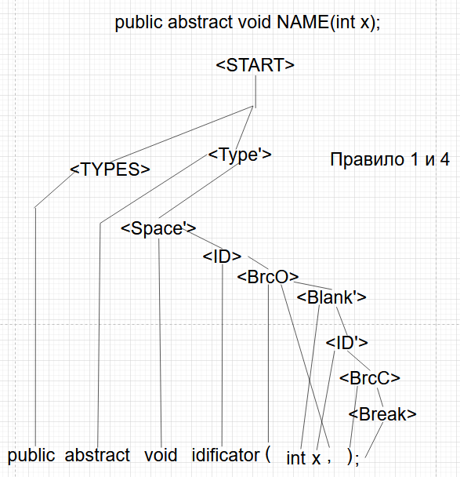
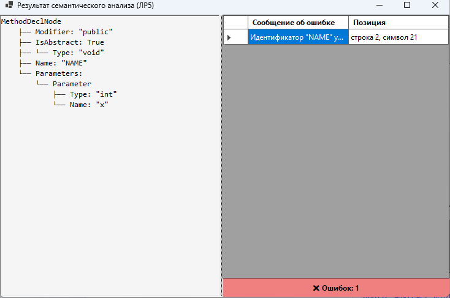
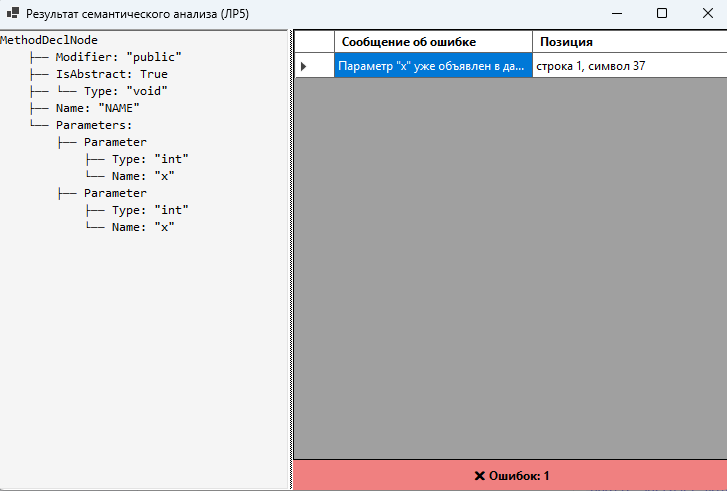
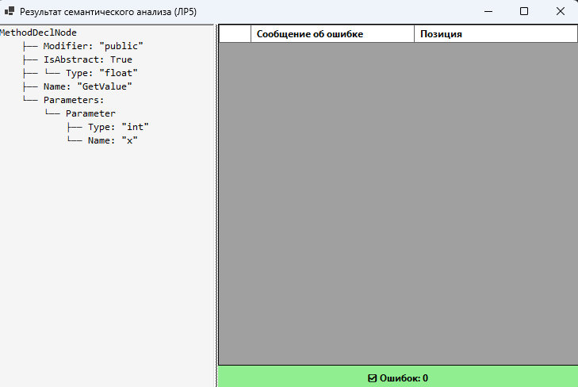

## Лабораторная работа №3
## Текстовый редактор для процессора

**Название:** Разработка синтаксического анализатора (парсера)

**Цель работы:** Изучить назначение и принципы работы синтаксического анализатора в структуре компилятора. Спроектировать грамматику, построить соответствующую схему метода анализа грамматики и выполнить программную реализацию парсера с нейтрализацией синтаксических ошибок методом Айронса. Интегрировать разработанный модуль в ранее созданный графический интерфейс языкового процессора.

---

## Сведения об авторе

**Автор:** Ковалев Егор

**Группа:** АП-327

**Дисциплина:** Теория формальных языков и компиляторов

**Год:** 2026

**Постановка задачи:**

Разработать синтаксический анализатор (парсер) в соответствии с индивидуальным вариантом курсовой (расчетно-графической) работы, интегрировать его в приложение из лабораторной работы №1 и обеспечить наглядный вывод результатов анализа.
---
**Вариант 33**
Текстовое описание: требуется анализировать строки вида
public abstract void NAME(int x);

где:

    public — обязательный модификатор доступа;

    abstract — обязательное ключевое слово;

    void (или int, string, char) — тип возвращаемого значения;

    NAME — идентификатор (имя метода);

    (int x) — список параметров (может быть пустым, может содержать несколько параметров через запятую);

    ; — обязательный символ конца оператора.

Допустимые лексемы:

    модификаторы: public, internal, protected (в данной работе обязателен public);

    ключевое слово abstract;

    типы: void, int, string, char;

    идентификаторы (буквы латинского алфавита, цифры, знак подчёркивания);

    разделители: пробел, (, ), ,, ;
Пример правильного ввода:

public abstract void Calculate(int x, int y);
public abstract int GetValue();

---
**Разработка грамматики:**

Грамматика G = (VT, VN, P, S)

Множество терминалов VT
{ (, ), ,, ;, _, a…z, A…Z, 0…9 }

Множество нетерминалов VN 
    
    {<START>, <TYPES>, <ABSTRACT>, <Type'>, <SPACE>, <Space'>, <Indef>, <ID>, <IDREM>, <BrcO>,  <Blank'>, <ID'>, <IND>, <IDrmn>, <BrcC>, <Break>}
    

    <START> → <modyf> <TYPES>

    <TYPES> → "_" <TYPE>

    <TYPE> → "abstract" <Type'>

    <Type'> → "_" <SPACE>

    <SPACE> → <tip> <Space'>

    <Space'> → "_" <Indef>

    <Indef> → <letter> <ID>

    <ID> → <letter> <IDREM>

    <IDREM> → <letter> <ID> | "(" <BrcO>

    <BrcO> → <tip> <Blank'>

    <Blank'> → "_" <ID'>

    <ID'> → <letter> <IND>

    <IND> → <letter> <IDrmn> | "," <BrcO> | ")" <BrcC>

    <BrcC> → ";" <Break>

    <Break> → ε

< tip > = "int" | "string" | "char"| "void"
< modyf >= "public" | "iternal" | "protected"

---
**На рисунке 1. представленна диаграмма сканера**

**Классификация грамматики по Хомскому**

Классификация грамматики по Хомскому: контекстно-свободная грамматика
A → α,A ∊ VN(один нетерминал), α ∊ V*(любая цепочка терминалов и нетерминалов)

---
**Метод анализа: Граф автоматной грамматики**

**На рисунке 3. Граф автоматной грамматики**

## Диагностика и нейтрализация синтаксических ошибок (метод Айронса)

**Диагностика ошибок**

При несоответствии текущей лексемы ожидаемому элементу формируется сообщение об ошибке, содержащее:

    Неверный фрагмент – сама лексема (или «конец строки»);

    Местоположение – номер строки и позиция символа;

    Описание ошибки – что ожидалось.

Примеры сообщений:

Ошибка	Сообщение

    Отсутствует public	«Ожидался модификатор доступа (public/internal/protected)»

    Отсутствует abstract	«Отсутствует ключевое слово 'abstract'»

    Неверный тип	«Ожидался тип возвращаемого значения (int/string/char/void)»

    Пропущена скобка	«Ожидалась открывающая скобка '('»

    Пропущено имя параметра	«Ожидалось имя параметра (идентификатор)»

## Нейтрализация ошибок (метод Айронса)

1. Обнаружение ошибки
2. Фиксация ошибки
3. Пропуск ошибочной лексемы
4. Продолжение разбора
5. Повторение цикла - шаги 1-4 повторяются до тех пор, пока не будут обработаны все лексемы входной строки. 
6. Вывод результатов

Пример восстановления после ошибки

Входная строка:

public void Calculate(int x, int y);

Ошибка: после модификатора public ожидается abstract, но встречен void.

Действия анализатора:

    Фиксируется ошибка: «Отсутствует ключевое слово 'abstract'».

    Пропускается токен void (он не является abstract).

    Анализ продолжается: следующий токен Calculate – идентификатор (имя метода). Далее разбор параметров выполняется корректно.

В результате будет обнаружена одна ошибка, а не каскад ошибок на каждом последующем токене.

Входная строка:

public abstract void Calculate(int x, int y);

**Пример правильного ввода:**

Входная строка:
public void Calculate(int x, int y);
**Пример неправильного ввода**

Входная строка:

public abstract void Calculate(int x, y);

**Пример неправильного ввода**

## Вывод

В ходе выполнения лабораторной работы был разработан синтаксический анализатор для объявления абстрактного метода на языке C#. Построена формальная грамматика, относящаяся к регулярным грамматикам (тип 3 по Хомскому). В качестве метода анализа выбран граф автоматной грамматики (конечный автомат), что соответствует структуре языка. Реализованы диагностика и нейтрализация синтаксических ошибок методом Айронса, позволяющие выявлять несколько ошибок за один проход. Разработанный парсер интегрирован в графический интерфейс текстового редактора и обеспечивает наглядный вывод результатов анализа с возможностью навигации по ошибкам.

## Лабораторная работа №4
## Реализация алгоритма поиска подстрок с помощью регулярных выражений
**Вариант:**
7(Построить РВ, описывающее формат имени файла .doc, .docx, .pdf,  .jpg, .jpeg, .png, .gif (можно выбрать другие 7 форматов файлов))
12(Построить РВ, описывающее биткоин-адрес или MultiSig биткоин-адрес.) 
27(Построить РВ для поиска HSL-кода цвета. Пример:hsl(120, 50%, 40%).)

**Цель работы:**

Изучить теоретические основы регулярных выражений и их применение для поиска и извлечения подстрок из текста. Освоить практические навыки использования библиотечных средств работы с регулярными выражениями, а также интеграцию алгоритмов поиска в графический интерфейс приложения.
**Постановка задачи:**

Разработать модуль поиска подстрок с использованием регулярных выражений, интегрировать его в существующее приложение (текстовый редактор) и обеспечить наглядный вывод результатов.

**Пункт 1**
пример верного и неверного ввода формата файлов

**Пункт 2**
пример верного ввода биткоин адреса

пример неверного ввода биткоин адреса

**Пункт 3**
Пример работы программы с HSL кодов цвета типа (hsl(120,50%,40%))

**Пункт 4(автомат)**
Пример работы программы с HSL кодов цвета типа (hsl(120,50%,40%)), но этот пункт был сделан при помощи конечного автомата

## Лабораторная работа №5
## Построение AST и проверка контекстно-зависимых условий
**Цель работы:**
Изучить назначение и принципы работы семантического анализатора в структуре компилятора. Освоить методы построения абстрактного синтаксического дерева (AST) и проверки контекстно-зависимых условий (семантических правил) для заданной синтаксической конструкции.
**Постановка задачи:**
Развить ранее созданный синтаксический анализатор (парсер) до семантического: построить абстрактное синтаксическое дерево (AST) и реализовать проверку контекстно-зависимых условий в соответствии с индивидуальным вариантом курсовой работы.

**Формат анализируемой конструкции:**
<модификатор_доступа> abstract <тип_возврата> <имя_метода> ( <список_параметров> ) ;

**Примеры корректных строк:**

public abstract void Calculate(int x, int y);

public abstract string GetName();

public abstract bool IsValid();

public abstract int GetValue();

**Семантические правила**
---
Правило 1: Уникальность идентификаторов

Описание: Имя метода не должно быть объявлено ранее в той же области видимости.

Вход 

public abstract void NAME(int x);

public abstract void NAME(int y);

Ожидаемый результат

Идентификатор "NAME" уже объявлен ранее

Правило 4: Уникальность параметров в сигнатуре
---
Описание: В пределах одной сигнатуры метода имена параметров должны быть уникальны.

Вход

public abstract void NAME(int x, int x);

Ожидаемый результат

Ошибка: Параметр "x" уже объявлен в данной сигнатуре

**Структура AST**
---
MethodDeclNode - Корневой узел объявления метода 

Его атрибуты - Modifier, IsAbstract, ReturnType, Name, Parameters

TypeNode - Узел типа данных

Его атрибуты - TypeName

ParameterNode - Узел параметра метода
Его атрибуты - ParamType, ParamName

**Текстовое представление (вывод программы)**

**Графическое представление**

**Тестовые примеры**
--- 
Пример вход:
public abstract void NAME(int x);

public abstract void NAME(int y);

Результат:

Ошибка: Идентификатор "NAME" уже объявлен ранее

Пример вход:

public abstract void NAME(int x, int x);

Результат:

 Ошибка: Параметр "x" уже объявлен в данной сигнатуре

Пример вход:

public abstract float GetValue(int x);

Результат:

AST построен (тип float разрешён)

**Инструкция по запуску**
Требования

    Visual Studio 2019/2022 (или выше)

    .NET Framework 4.7.2 или .NET 6.0+

    Windows 10/11

Сборка и запуск

    Откройте проект:

        Запустите Visual Studio

        Файл → Открыть → Проект/Решение

        Выберите файл LABA1A.sln

    Соберите проект:

        Нажмите Ctrl+Shift+B или Сборка → Сборка решения

        Убедитесь, что в окне "Выход" нет ошибок

    Запустите программу:

        Нажмите F5 или кнопку "Локальный отладчик"

        Или запустите .exe файл из папки bin/Debug

    Запуск семантического анализа (ЛР5):

        Введите код в редактор, например: public abstract void NAME(int x);

        Нажмите кнопку toolStripButton15 (или используйте меню, если настроено)

        В открывшемся окне просмотрите:

             Дерево AST (слева)

             Таблицу ошибок (справа)

             Счётчик ошибок (внизу)

Структура проекта

LABA1A/

├── Form1.cs          # Основной код формы и анализаторов

├── Form1.Designer.cs # Автоматически сгенерированный UI-код

├── Program.cs        # Точка входа

└── ...               # Другие файлы проекта

**Ключевые классы**

| Класс | Назначение |
|:---|:---|
| `Scanner` | Лексический анализ (токенизация) |
| `Parser` | Синтаксический анализ (рекурсивный спуск) |
| `SemanticAnalyzer` | Семантический анализ и построение AST |
| `SymbolTable` | Таблица символов для проверки уникальности |
| `MethodDeclNode` | Узел AST для объявления метода |
| `ParameterNode` | Узел AST для параметра метода |
| `TypeNode` | Узел AST для типа данных |
| `LiteralNode` | Узел AST для литеральных значений |
| `AstNode` | Базовый абстрактный класс для всех узлов AST |
| `Token` | Представление лексемы (тип, значение, позиция) |
| `SyntaxError` | Информация о синтаксической ошибке |
| `SemanticError` | Информация о семантической ошибке |
| `SymbolInfo` | Хранение информации об идентификаторе в таблице символов 
