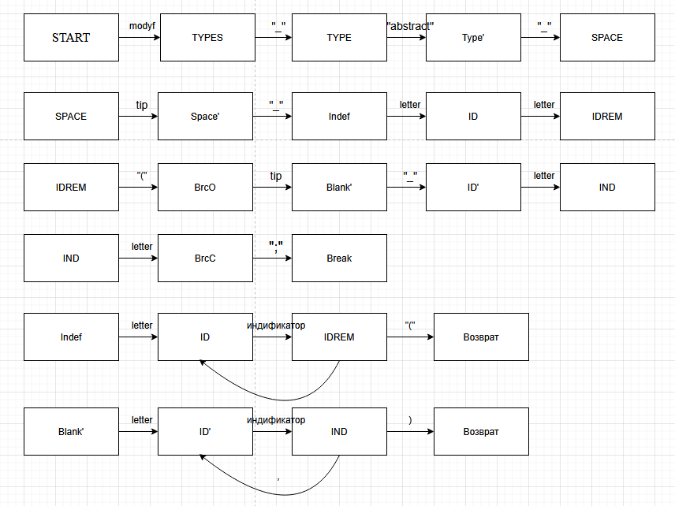
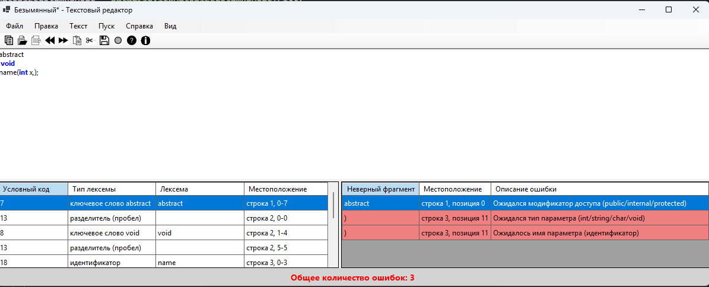

## Текстовый редактор для процессора

**Название:** Разработка синтаксического анализатора (парсера)

**Цель работы:** Изучить назначение и принципы работы синтаксического анализатора в структуре компилятора. Спроектировать грамматику, построить соответствующую схему метода анализа грамматики и выполнить программную реализацию парсера с нейтрализацией синтаксических ошибок методом Айронса. Интегрировать разработанный модуль в ранее созданный графический интерфейс языкового процессора.

---

## Сведения об авторе

**Автор:** Ковалев Егор

**Группа:** АП-327

**Дисциплина:** Теория формальных языков и компиляторов

**Год:** 2026

**Постановка задачи:**
Разработать синтаксический анализатор (парсер) в соответствии с индивидуальным вариантом курсовой (расчетно-графической) работы, интегрировать его в приложение из лабораторной работы №1 и обеспечить наглядный вывод результатов анализа.

**Вариант 33**
Объявление абстрактного метода на языке C#
public abstract void NAME(int x);

Пример правильного ввода:
public abstract void NAME(int x);
internal abstract int a(int x, char y);

**Разработка грамматики:**
<START>->modyf<TYPES> 
<TYPES> -> "_" <TYPE>
<TYPE>-> "abstract" <Type'> 
<Type'> -> "_" <SPACE>
<SPACE> -> tip <Space'>
<Space'>-> "_"<Indef>
<Indef> letter <ID> 
<ID> -> letter <IDREM>
<IDREM> -> letter <ID> |"(" <BrcO>
<BrcO> -> tip <Blank'> 
<Blank'>-> "_" <ID'>
<ID'> -> letter <IND>
<IND> -> letter <IDrmn> | "," <BrcO> | ")" <BrcC>

<BrcC> -> ";" <Break>
keyw = "abstract"
tip = "int" | "string" | "char"| "void"
modyf= "public" | "iternal" | "protected"

Классификация грамматики по Хомскому: контекстно-свободная грамматика

**Метод анализа: Рекурсивный спуск**
---

**На рисунке 1. предстьален рекурсивный спуск для грамматики выше.**

**Пример правильного ввода:**

**Пример неправильного ввода**

**Пример многострочия:**

