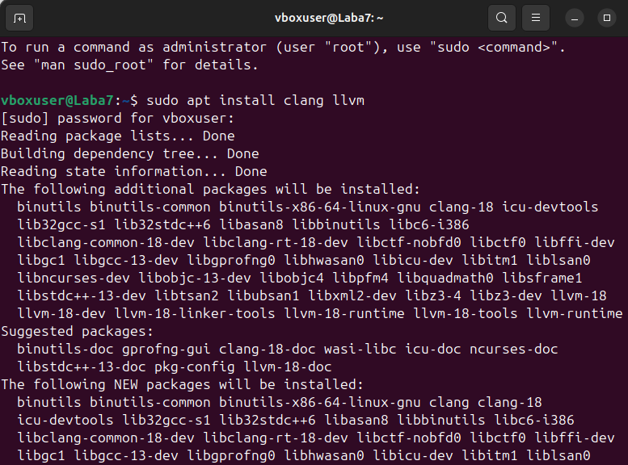
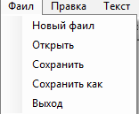
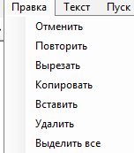
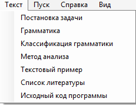
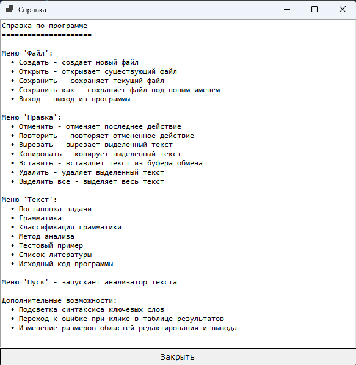
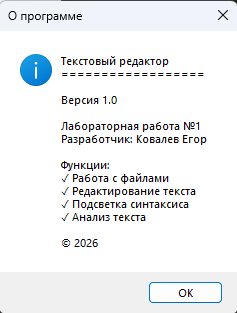
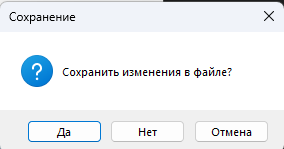
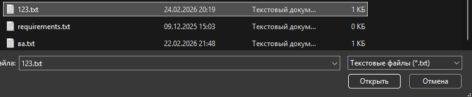
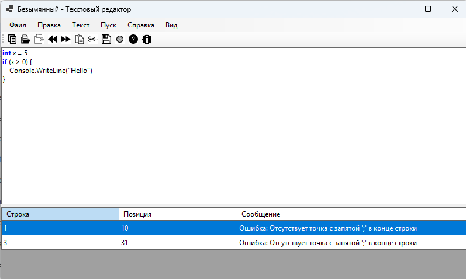
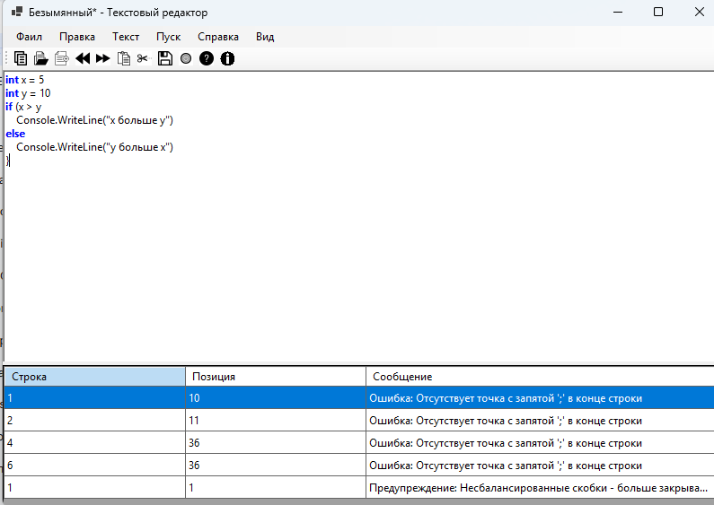

# Текстовый редактор с функциями языкового процессора

## Название и цель лабораторной работы

**Название:** Разработка текстового редактора с графическим интерфейсом

**Цель работы:** Разработать приложение – текстовый редактор, который в дальнейшем будет дополнен функциями языкового процессора. Приложение должно иметь графический интерфейс пользователя с возможностью редактирования текста, сохранения/загрузки файлов и вывода результатов работы анализатора.

---

## Сведения об авторе

**Автор:** Ковалев Егор

**Группа:** АП-327

**Дисциплина:** Теория формальных языков и компиляторов

**Год:** 2026

---

## Описание проекта

Реализован полнофункциональный текстовый редактор с графическим интерфейсом на платформе Windows Forms, поддерживающий базовые операции редактирования текста, работу с файлами и имеющий область вывода результатов работы синтаксического анализатора. Приложение разработано в соответствии с требованиями лабораторной работы и подготовлено для дальнейшего расширения функционала языкового процессора.

### Основные возможности:
- 📝 Создание, открытие, сохранение текстовых файлов (TXT)
- ✂️ Полный набор операций редактирования (отмена/повтор, вырезание/копирование/вставка, удаление, выделение всего текста)
- 🎨 Панель инструментов с иконками для быстрого доступа к основным функциям
- 🔄 Область редактирования и область вывода результатов с возможностью изменения их размера
- 📊 Таблица результатов с отображением ошибок (строка, позиция, сообщение)
- 🔍 Переход к позиции ошибки при клике на сообщении в таблице результатов
- 🎯 Подсветка ошибочного фрагмента красным цветом
- ✨ Подсветка синтаксиса ключевых слов (дополнительное задание)
- 📖 Информационные окна с описанием грамматики, метода анализа, постановки задачи
- 🚀 Запуск анализатора текста с проверкой синтаксиса
- ❓ Контекстная справка и информация о программе
- 💾 Запрос на сохранение изменений при закрытии или открытии нового файла

---

## Используемые технологии

| Компонент | Технология |
|-----------|------------|
| Язык программирования | C# 10.0 |
| Платформа | .NET 6.0 / .NET Framework 4.8 |
| Фреймворк для GUI | Windows Forms |
| Среда разработки | Microsoft Visual Studio 2022 |
| Формат файлов | TXT |

---
Главное окно приложения

Основные элементы интерфейса:

    Заголовок окна - отображает название приложения и имя текущего файла (звездочка * означает несохраненные изменения)

    Главное меню - содержит все команды программы, сгруппированные по разделам

    Панель инструментов - кнопки быстрого доступа к часто используемым функциям

    Область редактирования - основная рабочая область для ввода и редактирования текста

    Область вывода результатов (DataGridView) - таблица с результатами работы анализатора

    Разделитель - позволяет изменять соотношение размеров областей
### Главное меню
### Меню "Файл"

### Меню "Правка"

### Меню "Текст"

### Меню "Справка"

### Меню "О программе"
 
### Создание нового документа

### Открытие файла

    Нажмите "Файл" → "Открыть" или кнопку "Открыть"
    Выберите файл в диалоговом окне
    Содержимое файла загрузится в редактор

Сохранение файла

    Нажмите "Файл" → "Сохранить" или кнопку "Сохранить"
    Если файл новый - укажите имя и расположение
    
### Запуск анализатора
 

### Требования к системе
- Windows 7 / 8 / 10 / 11
- Установленный .NET 6.0 Runtime (или SDK для разработки)
- Не менее 50 МБ свободного места

Основные классы и методы
Класс/Метод	Описание
Form1	Главная форма приложения
InitializeCustomComponents()	Инициализация дополнительных компонентов
SubscribeMenuEvents()	Подписка на события меню
NewFile_Click()	Создание нового файла
OpenFile_Click()	Открытие файла
SaveFile_Click()	Сохранение файла
StartAnalysis_Click()	Запуск анализатора
AnalyzeText()	Анализ текста и поиск ошибок
HighlightSyntax()	Подсветка синтаксиса (доп. задание)
DataGridView1_CellClick()	Обработка клика на ошибке

Заключение

Разработанное приложение полностью соответствует требованиям лабораторной работы:
Требование	Статус
Графический интерфейс пользователя	✅
Работа без установленной IDE	✅
Корректный заголовок окна	✅
Все функции меню "Файл", "Правка", "Справка"	✅
Реакция на изменение размера окна	✅
Изменение соотношения размеров областей	✅
Полосы прокрутки	✅
Запрос на сохранение изменений	✅
Подсветка синтаксиса (доп. задание)	✅

Приложение готово к дальнейшему расширению функционала языкового процессора.