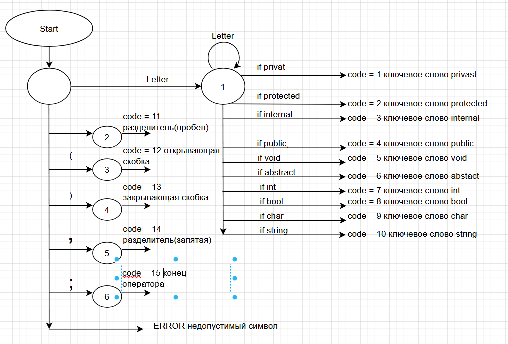
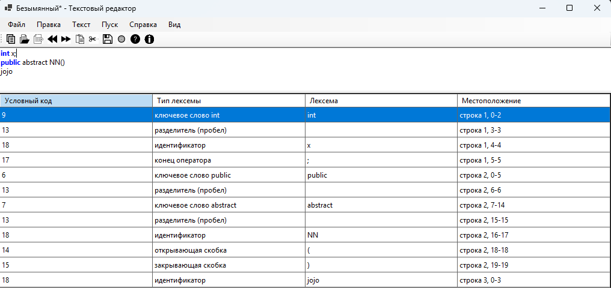
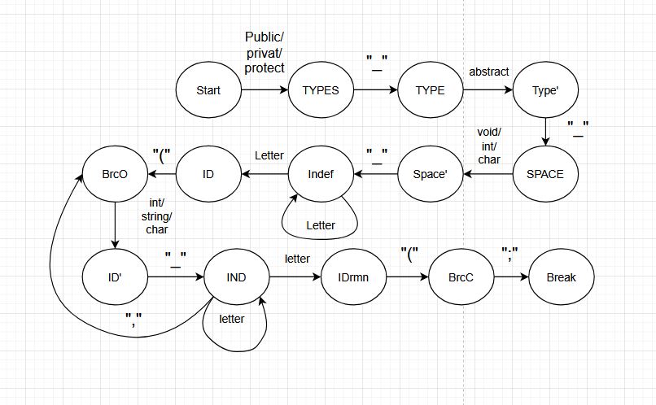
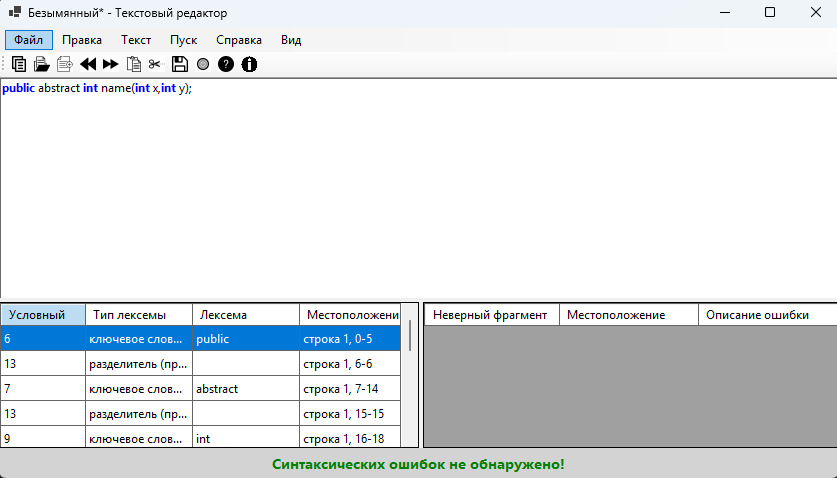
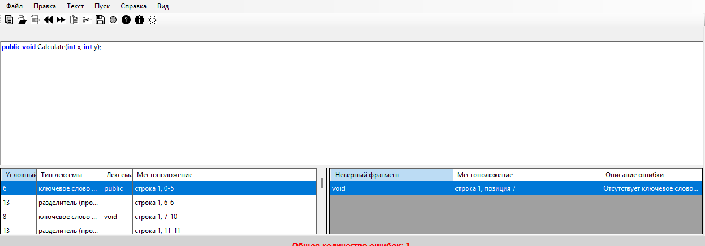
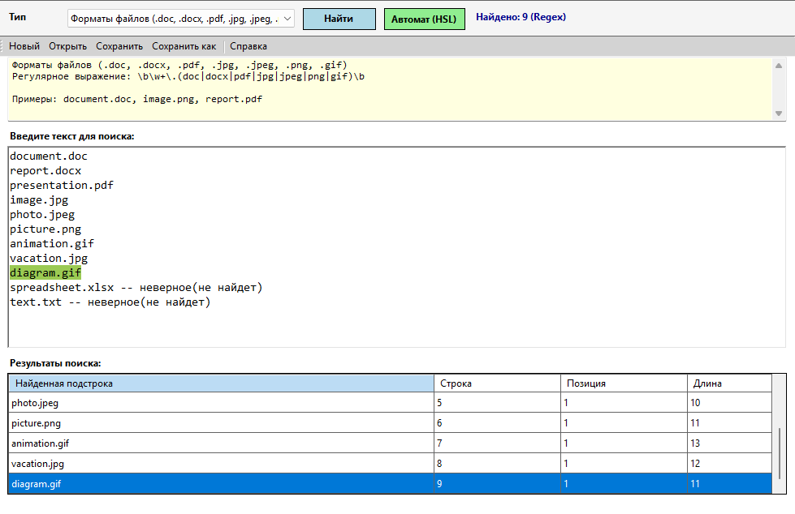
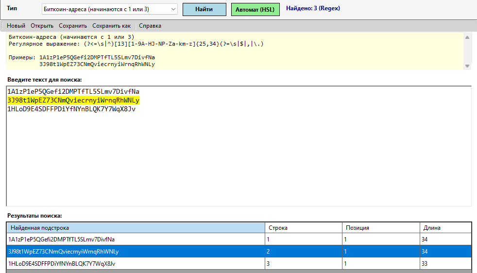
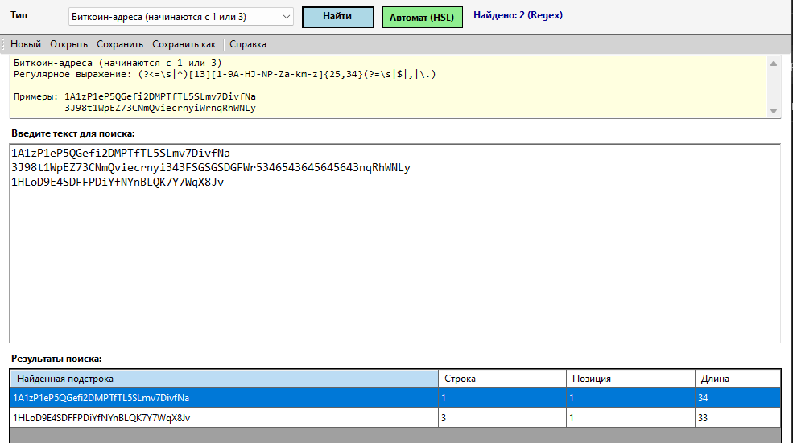
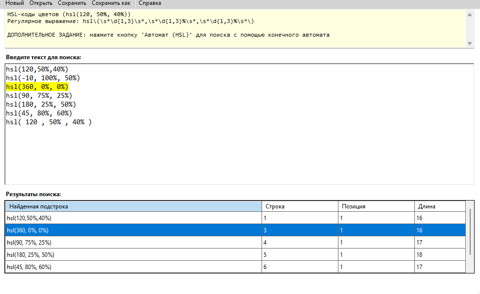
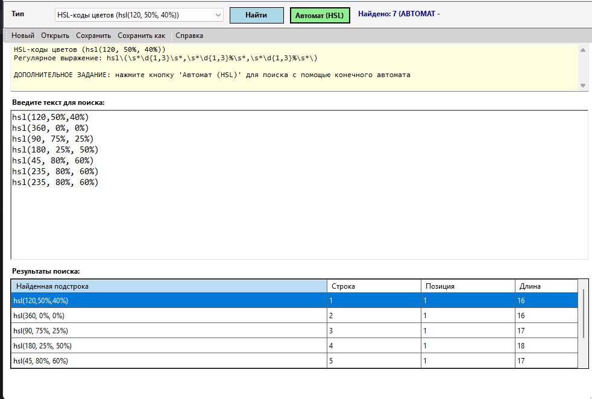

## Лабораторная работа №3
## Текстовый редактор для процессора

**Название:** Разработка синтаксического анализатора (парсера)

**Цель работы:** Изучить назначение и принципы работы синтаксического анализатора в структуре компилятора. Спроектировать грамматику, построить соответствующую схему метода анализа грамматики и выполнить программную реализацию парсера с нейтрализацией синтаксических ошибок методом Айронса. Интегрировать разработанный модуль в ранее созданный графический интерфейс языкового процессора.

---

## Сведения об авторе

**Автор:** Ковалев Егор

**Группа:** АП-327

**Дисциплина:** Теория формальных языков и компиляторов

**Год:** 2026

**Постановка задачи:**

Разработать синтаксический анализатор (парсер) в соответствии с индивидуальным вариантом курсовой (расчетно-графической) работы, интегрировать его в приложение из лабораторной работы №1 и обеспечить наглядный вывод результатов анализа.
---
**Вариант 33**
Текстовое описание: требуется анализировать строки вида
public abstract void NAME(int x);

где:

    public — обязательный модификатор доступа;

    abstract — обязательное ключевое слово;

    void (или int, string, char) — тип возвращаемого значения;

    NAME — идентификатор (имя метода);

    (int x) — список параметров (может быть пустым, может содержать несколько параметров через запятую);

    ; — обязательный символ конца оператора.

Допустимые лексемы:

    модификаторы: public, internal, protected (в данной работе обязателен public);

    ключевое слово abstract;

    типы: void, int, string, char;

    идентификаторы (буквы латинского алфавита, цифры, знак подчёркивания);

    разделители: пробел, (, ), ,, ;
Пример правильного ввода:

public abstract void Calculate(int x, int y);
public abstract int GetValue();
---
**Разработка грамматики:**

Грамматика G = (VT, VN, P, S)

Множество терминалов VT
{ public, internal, protected, abstract, void, int, string, char, (, ), ,, ;, _, a…z, A…Z, 0…9 }

Множество нетерминалов VN
{ START, MODIFIER, MODIFIER_TAIL, ABSTRACT, TYPE, IDENTIFIER, IDENTIFIER_TAIL, PARAMS, PARAM, PARAMS_TAIL, LETTER, DIGIT }

Аксиома S = START
1.  START         → MODIFIER ABSTRACT TYPE IDENTIFIER '(' PARAMS ')' ';'
2.  MODIFIER      → 'public' MODIFIER_TAIL
3.  MODIFIER_TAIL → ε | MODIFIER
4.  ABSTRACT      → 'abstract'
5.  TYPE          → 'void' | 'int' | 'string' | 'char'
6.  IDENTIFIER    → LETTER IDENTIFIER_TAIL
7.  IDENTIFIER_TAIL → LETTER IDENTIFIER_TAIL | DIGIT IDENTIFIER_TAIL | ε
8.  PARAMS        → ε | PARAM PARAMS_TAIL
9.  PARAMS_TAIL   → ε | ',' PARAM PARAMS_TAIL
10. PARAM         → TYPE IDENTIFIER
11. LETTER        → 'a' | 'b' | ... | 'z' | 'A' | 'B' | ... | 'Z' | '_'
12. DIGIT         → '0' | '1' | ... | '9'

Пояснение к грамматике
Правило 1 задаёт общую структуру объявления: модификатор, abstract, тип, имя метода, открывающая скобка, параметры, закрывающая скобка, точка с запятой.

Правила 2–3 описывают необязательные модификаторы (в рамках данной работы обязателен public, но грамматика допускает и другие модификаторы).

Правило 4 фиксирует обязательное ключевое слово abstract.

Правило 5 определяет допустимые типы возвращаемого значения.

Правила 6–7 описывают идентификатор (имя метода или параметра) как последовательность букв и цифр, начинающуюся с буквы.

Правила 8–9 описывают список параметров: может быть пустым, либо содержать один или несколько параметров, разделённых запятыми.

Правило 10 определяет параметр: тип и имя.

Правила 11–12 задают буквы и цифры.

---
**На рисунке 1. представленна диаграмма сканера**

**Классификация грамматики по Хомскому**

Классификация грамматики по Хомскому: контекстно-свободная грамматика
A → α,A ∊ VN(один нетерминал), α ∊ V*(любая цепочка терминалов и нетерминалов)

---
**Метод анализа: Граф автоматной грамматики**

**На рисунке 1. Граф автоматной грамматики**

Состояние	Описание	Выходные переходы
    S (начальное)	Ожидание public	public → A
    A	После public, ожидание abstract	abstract → B
    B	После abstract, ожидание типа	void / int / string / char → C
    C	После типа, ожидание первой буквы идентификатора	буква / _ → D
    D	Чтение идентификатора (имя метода)	буква / цифра / _ → D (петля), '(' → E
    E	После имени метода, ожидание '('	'(' → F
    F	Внутри скобок, анализ параметров	(см. ниже)
    G	Пустой список параметров: после '(' сразу ')'	')' → L
    H	Начало параметра: тип	int / string / char → K
    I	После запятой, ожидание следующего параметра	тип → H
    J	После ')', ожидание ';'	';' → M
    K	После типа параметра, ожидание имени	идентификатор → (возврат в F для проверки запятой или ')')
    L	После ')', ожидание ';'	';' → M
    M	После ';', завершение	(пустой переход) → end
    end (конечное)	Успешное завершение	–

Пояснение для параметров (состояния F, G, H, I, J, K, L, M)

    F – главное состояние внутри скобок. Возможны варианты:

        если следующий токен ')' → перейти в G (пустые параметры) → затем L → M → end.

        если следующий токен – тип (int, string, char) → перейти в H (начало параметра).

    H – зафиксирован тип параметра. Затем ожидается идентификатор → переход в K.

    K – прочитано имя параметра. Далее:

        если следующий токен ',' → перейти в I (запятая) → затем снова H (следующий параметр).

        если следующий токен ')' → перейти в L (закрывающая скобка).

    I – прочитана запятая, ожидание следующего параметра → переход в H.

    L – закрывающая скобка ')'. Затем ожидание ';' → переход в M.

    M – точка с запятой ';'. Затем переход в конечное состояние end.

## Диагностика и нейтрализация синтаксических ошибок (метод Айронса)

**Диагностика ошибок**

При несоответствии текущей лексемы ожидаемому элементу формируется сообщение об ошибке, содержащее:

    Неверный фрагмент – сама лексема (или «конец строки»);

    Местоположение – номер строки и позиция символа;

    Описание ошибки – что ожидалось.

Примеры сообщений:
Ошибка	Сообщение
Отсутствует public	«Ожидался модификатор доступа (public/internal/protected)»
Отсутствует abstract	«Отсутствует ключевое слово 'abstract'»
Неверный тип	«Ожидался тип возвращаемого значения (int/string/char/void)»
Пропущена скобка	«Ожидалась открывающая скобка '('»
Пропущено имя параметра	«Ожидалось имя параметра (идентификатор)»

**Нейтрализация ошибок (метод Айронса)**

1. Обнаружение ошибки
2. Фиксация ошибки
3. Пропуск ошибочной лексемы
4. Продолжение разбора
5. Повторение цикла - шаги 1-4 повторяются до тех пор, пока не будут обработаны все лексемы входной строки. 
6. Вывод результатов

Пример восстановления после ошибки
Входная строка:
public void Calculate(int x, int y);
Ошибка: после модификатора public ожидается abstract, но встречен void.

Действия анализатора:

    Фиксируется ошибка: «Отсутствует ключевое слово 'abstract'».

    Пропускается токен void (он не является abstract).

    Анализ продолжается: следующий токен Calculate – идентификатор (имя метода). Далее разбор параметров выполняется корректно.

В результате будет обнаружена одна ошибка, а не каскад ошибок на каждом последующем токене.

Входная строка:
public abstract void Calculate(int x, int y);
**Пример правильного ввода:**

Входная строка:
public void Calculate(int x, int y);
**Пример неправильного ввода**

Входная строка:
public abstract void Calculate(int x, y);
**Пример неправильного ввода**

## Вывод

В ходе выполнения лабораторной работы был разработан синтаксический анализатор для объявления абстрактного метода на языке C#. Построена формальная грамматика, относящаяся к регулярным грамматикам (тип 3 по Хомскому). В качестве метода анализа выбран граф автоматной грамматики (конечный автомат), что соответствует структуре языка. Реализованы диагностика и нейтрализация синтаксических ошибок методом Айронса, позволяющие выявлять несколько ошибок за один проход. Разработанный парсер интегрирован в графический интерфейс текстового редактора и обеспечивает наглядный вывод результатов анализа с возможностью навигации по ошибкам.

## Лабораторная работа №4
## Реализация алгоритма поиска подстрок с помощью регулярных выражений
**Вариант:**
7(Построить РВ, описывающее формат имени файла .doc, .docx, .pdf,  .jpg, .jpeg, .png, .gif (можно выбрать другие 7 форматов файлов))
12(Построить РВ, описывающее биткоин-адрес или MultiSig биткоин-адрес.) 
27(Построить РВ для поиска HSL-кода цвета. Пример:hsl(120, 50%, 40%).)

**Цель работы:**

Изучить теоретические основы регулярных выражений и их применение для поиска и извлечения подстрок из текста. Освоить практические навыки использования библиотечных средств работы с регулярными выражениями, а также интеграцию алгоритмов поиска в графический интерфейс приложения.
**Постановка задачи:**

Разработать модуль поиска подстрок с использованием регулярных выражений, интегрировать его в существующее приложение (текстовый редактор) и обеспечить наглядный вывод результатов.

**Пункт 1**

**Пункт 2**

**Пункт 3**

**Пункт 3(автомат)**

